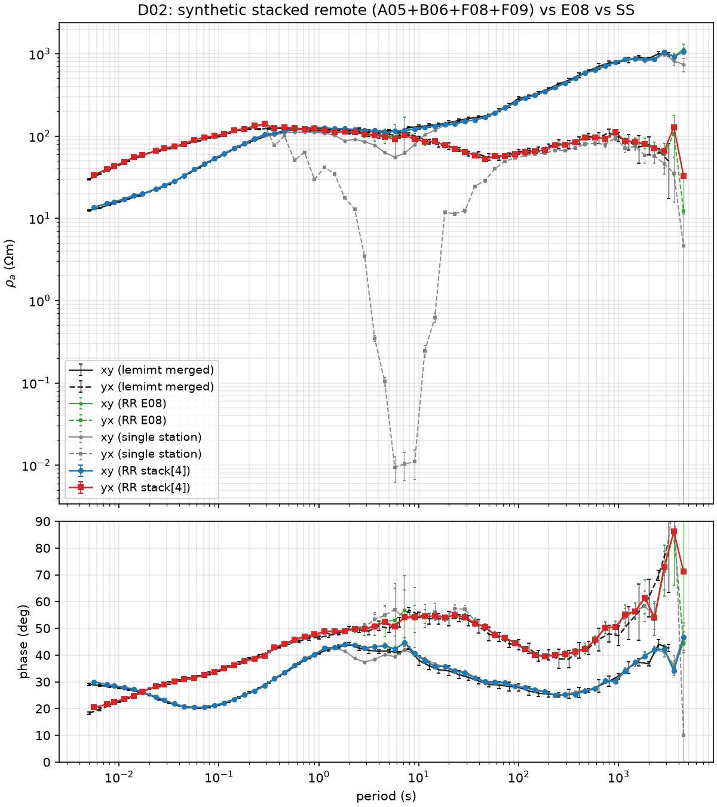
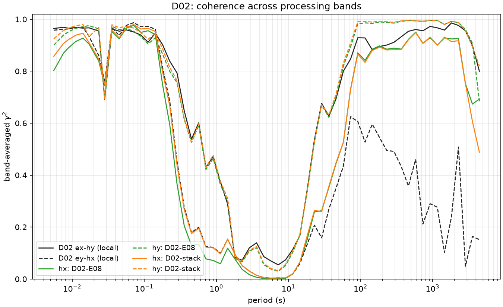
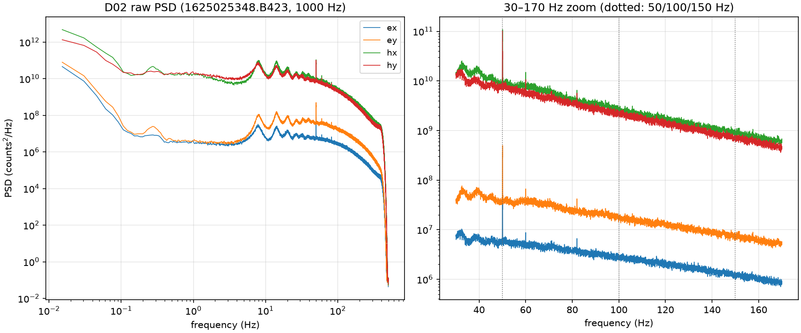

# BBMT-processing-2026 — handover (2026-09-21)

Where the broadband MT workflow stands after the first build-and-validate
session, what was learned, and what comes next. Repo:
https://github.com/bvkay/BBMT-processing-2026

## What works (validated)

The full vertical slice runs end-to-end on Curnamona Cube LEMI-423 data:

**raw B423 → MTH5 (mt-io readers) → aurora (RR) → EDI → comparison figure**

- `examples/01_validate_d02_e08.py` — D02 remote-referenced on E08, full
  deployment, matches the merged lemimt EDI from **0.005 s to ~3000 s** in
  rho and phase, both modes
  ([figure](docs/figures/D02_rr-E08_vs_lemimt.png)).
- `examples/02_synthetic_remote_d02.py` — synthetic stacked remote
  (mean of raw hx/hy from A05+B06+F08+F09) performs on par with the best
  single remote; single-station shown for contrast (catastrophic dead-band
  bias) ([figure](docs/figures/D02_synthetic_rr_comparison.png)).
- `examples/03_coherence_d02.py` — band-averaged coherence QC on the same
  period axis as the TF plots
  ([figure](docs/figures/D02_band_coherence.png)).

Environment: `conda env create -f environment.yml` → `bbmt-2026`
(pins the known-good stack: mth5 0.6.9, mt-io 0.0.5, mt-metadata 1.0.10,
aurora 0.6.2). Machine used: 128 GB RAM Windows box; full-deployment runs
peak ~10–15 GB.

## Decisions made

- **Thin library, headless first, GUI later.** `bbmt` wraps the community
  packages; workflow decisions live in per-survey YAML, not notebooks.
- **Processing products are RR only**: remote-reference with an adjacent
  site, and remote-reference with a coherence-QC'd stack. Single-station is
  a diagnostic, not a deliverable (Ben, 2026-09-21).
- **Visual comparisons over numbers** — every validation/QC step emits a
  figure; new result bold + coloured, references grey/black, error bars on
  both.
- **Site = folder name**; survey config points at the raw-data root and
  discovers sites (`surveys/curnamona_cube/survey.yaml` is the template).
- Upstream bugs get logged in `docs/upstream_issues.md` when we work around
  them (3 mt-io entries so far — the coil-response unit names, the filter
  chain units/order, and the dipole-length warning).

## Hard-won facts (do not rediscover these)

1. **LEMI-423 magnetics come out of mt-io in pT with inverted polarity**
   relative to the lemimt convention. Fixed by an explicit
   CoefficientFilter gain **−1000** on hx/hy/hz (`h_scale` in survey.yaml).
   Established empirically: constant 10⁶ rho offset, both phases exactly
   180° off, |Z| factor 986 ≈ 1000.
2. **Coil response**: use `sensors/l120n.rsp` (Ben's instruction). The
   mt-io coil-response path had never run on this stack — unit-name
   validation fails; shimmed in `bbmt.ingest._read_coil_response`.
3. **Contiguous B423 files must be merged into long runs at ingest.**
   Files are exactly back-to-back (epoch spacing = 5400 s file length,
   except the first partial file). Aurora STFTs per run, so 90-min
   one-file runs cap estimable periods at ~300 s regardless of band setup.
4. **Band scheme** (`bbmt.bands.lemimt_band_scheme`): even log spread,
   10 periods/decade, 60 bands over 10 factor-4 decimation levels,
   window 128, 75% overlap on levels with >10-min windows. **Mains must be
   notched** (`notch_frequencies: [50, 150]`): a band edge landing on
   50 Hz caused a visible artefact at 0.02 s.
5. **The RR estimator is calibration-invariant**, so synthetic remotes
   stack **raw counts** — no deconvolution. GPS ms-grids aligned exactly
   across all instruments tested (asserted in code, never assume).
6. **One dead channel poisons a mean stack.** A07's hx is dead for the
   test window (γ²=0 vs E08 at all periods; its hy is fine) — found via
   the member coherence scan. Site QC findings:
   `surveys/curnamona_cube/qc_notes.md`.
7. **The 2–10 s dead band is real and total** at these sites (all
   coherences → ~0). Error bars balloon there; no remote fixes it.
8. **Code gotchas**: RunTS channel accessors (`run.hx`) return copies —
   durable edits go through `run.dataset` attrs and `run.filters`; aurora
   needs `num_samples_window` as a per-level *list* when `band_edges` is
   passed; mt_metadata `MTime` needs `str()` before `pd.Timestamp`; never
   run two processes against the same MTH5 (HDF5 locking).

## Next up: Burra 2017–2020 (the noisy one)

- Raw data: `E:\MT_Timeseries_DATA\MT_Burra_2017-2020` — **one zip per
  site** (Burra01.zip …), ~80+ sites over multiple stages with different
  sites concurrent. Zips need extracting (or a zip-aware reader) before the
  current ingest can see them.
- **Burra54 ran as a de-facto remote reference** (clean site); the
  coherent stack should also be tried across whatever is concurrent per
  stage.
- Expected noise: 50 Hz + harmonics, **cathodic protection from
  high-pressure gas mains**, wind farms, more. All processable — Ben has
  done it with lemimt; reference EDIs: `E:\Ben_Documents\EDIs\Burra_2017-18`
  (83 EDIs, names match site names directly — no coordinate matching
  needed).
- Metadata/timing: `E:\MT_Timeseries_DATA\MT_Burra_2017-2020\BurraTimingPhase2.xlsx`
  (adapt `scripts/site_table_to_yaml.py` to its columns).
- Suggested first move: extract Burra54 + one noisy site, run
  `scripts/noise_psd.py` on both, build the survey.yaml, then repeat the
  01/03 pattern (process + coherence QC) before reaching for masking.

## Roadmap after Burra ingest

- Coherence-weighted stacking: per-member weights per time chunk and band
  group (0.1–1 / 1–10 / 10–100 / 100–1000 s); median stack as robust
  baseline; full per-band weighting at the Fourier-coefficient level.
- Time-resolved coherence QC ("coherogram") over pairs Bx–Ey, By–Ex,
  Bx–By, Ex–Ey, Ex–remote-By, Ey–remote-Bx — drives both stack weights and
  time masking for noisy sites; Python rebuild of the MATLAB app's
  Coherence tab.
- 50 Hz band-placement experiment: edge vs notched vs band-centred.
- Earth Data logger ingest (mt-io `uoa` readers), batch CLI, then the
  Panel GUI mirroring the old MATLAB app's tab flow.

## Figures

| | |
|---|---|
|  |  |
|  |  |
