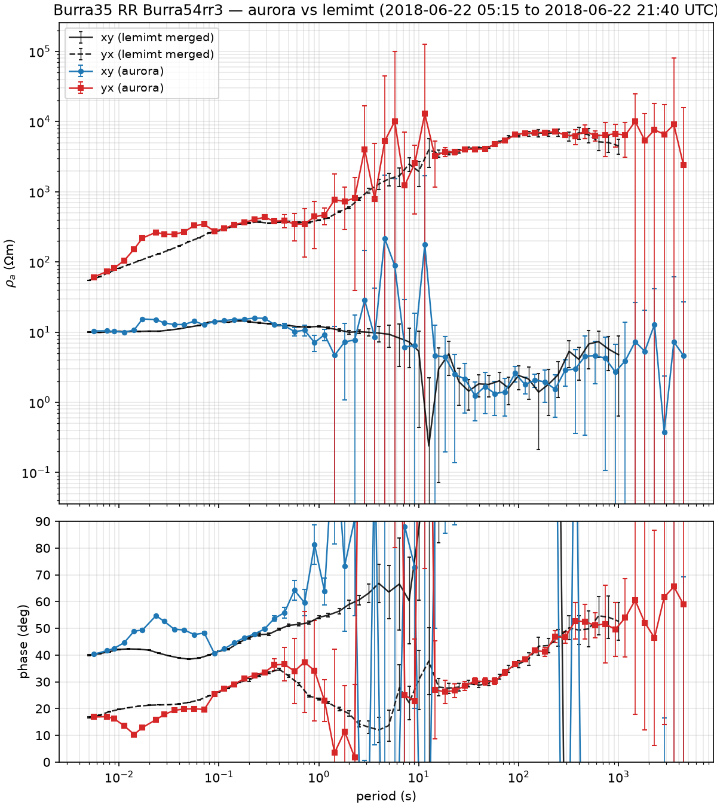
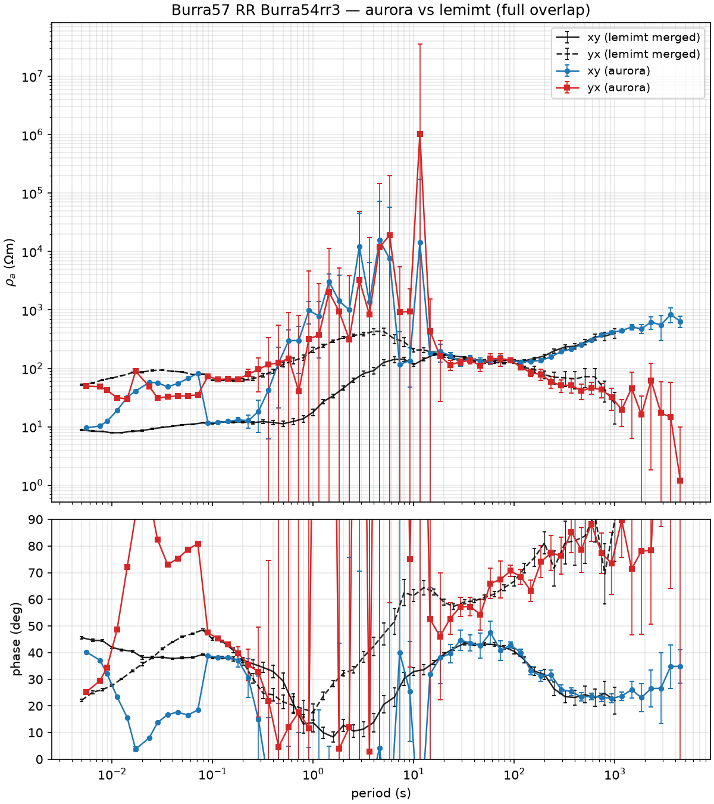
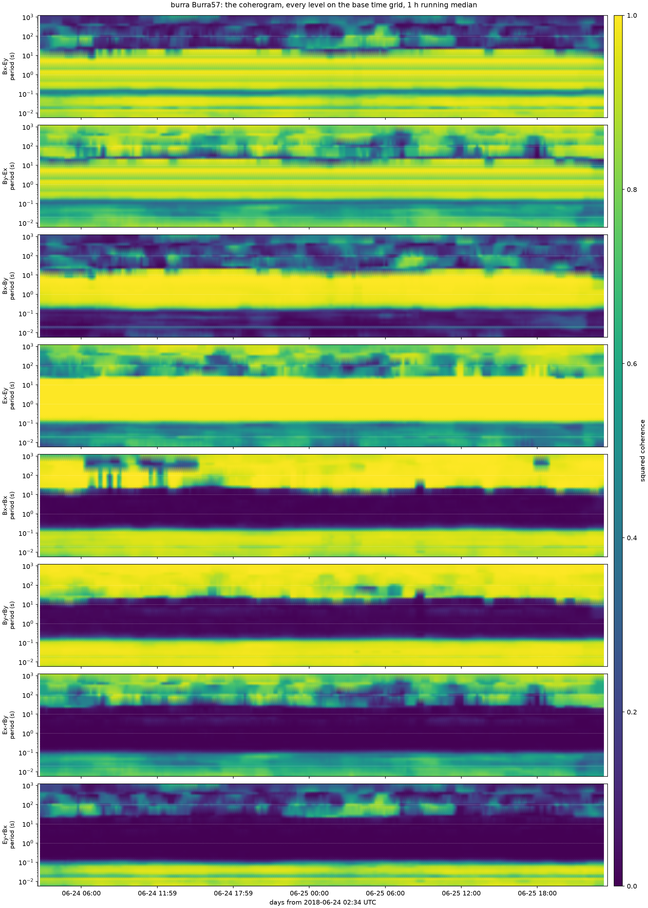
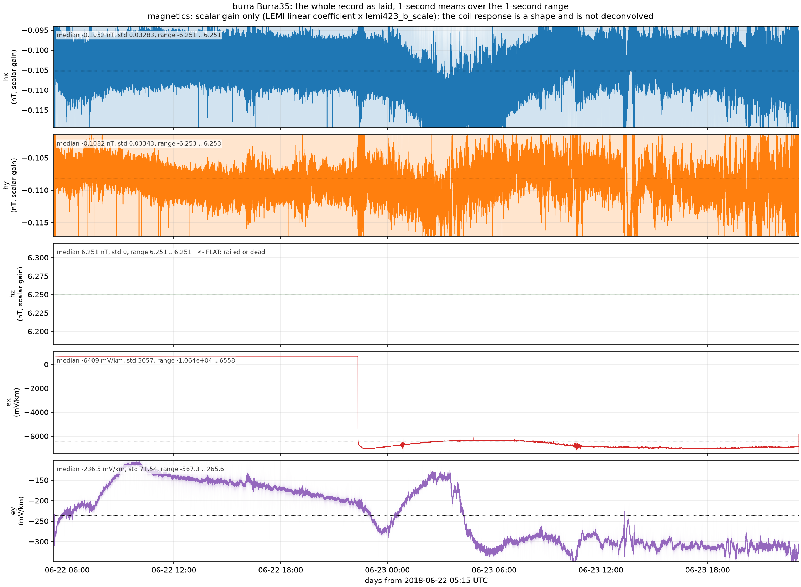
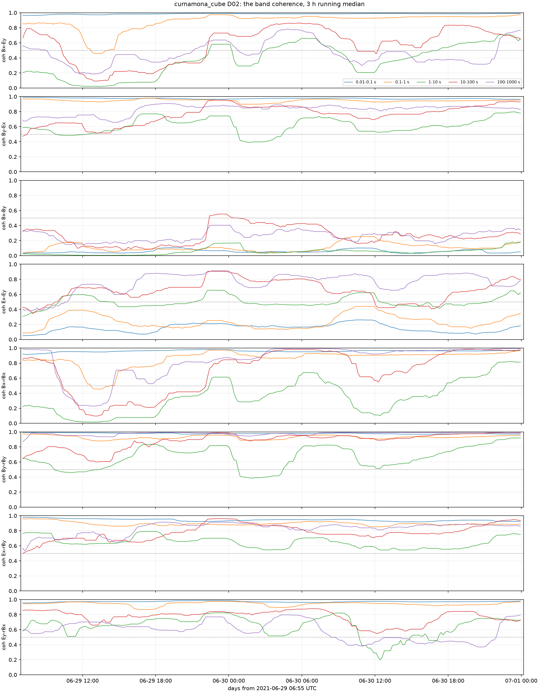
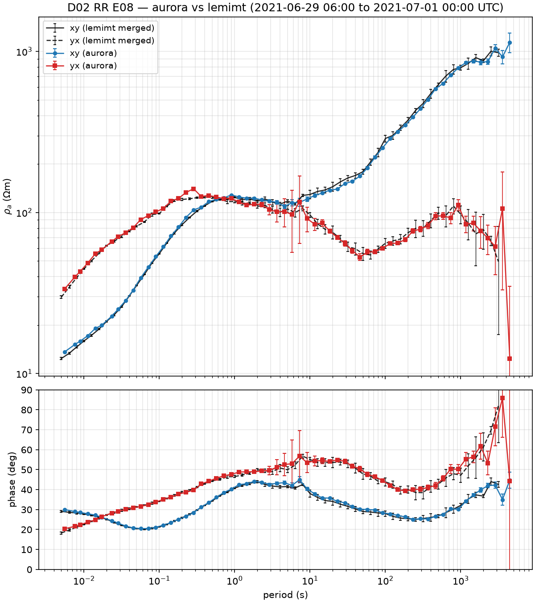

# BBMT-processing-2026 - handover (2026-09-23)

Where the broadband MT workflow stands after three sessions: the Curnamona
build-and-validate day (2026-09-21), the first Burra (noisy) day (2026-09-22),
and the GUI phase (2026-09-22/23, this handover). Repo:
https://github.com/bvkay/BBMT-processing-2026

The student-facing command line is the table in `README.md`; every step is a
plain script (no notebooks, no LLM at run time). The desktop GUI
(`src/bbmt_gui`, authoritative doc `src/bbmt_gui/README.md`) is a launcher and
viewer over those scripts and each survey's YAML - it computes no product of
its own. Per-site findings live in each survey's `qc_notes.md`.

## What works (validated)

**raw B423 -> MTH5 (mt-io readers) -> aurora (RR) -> EDI -> comparison figure**

- **Curnamona D02 RR E08** (`examples/01_validate_d02_e08.py`): matches the
  merged lemimt EDI from 0.005 s to ~3000 s in rho and phase, both modes
  ([figure](docs/figures/D02_rr-E08_vs_lemimt.png)). Synthetic stacked remote
  and band-averaged coherence QC as before (`examples/02`, `03`).
- **Burra35 RR Burra54rr3** on its good-Ex window (first 16.5 h) **with the
  declared filters** (mains notch, then the 12 s stack-and-subtract): both
  modes match lemimt from 0.005 s to 1000 s including the cathodic-protection
  band ([figure](docs/figures/Burra35_rr-Burra54rr3_filtered_vs_lemimt.png);
  [unfiltered](docs/figures/Burra35_rr-Burra54rr3_window_vs_lemimt.png) for
  contrast: 1-15 s lost).
- **Burra57 RR Burra54rr3 with the declared filters** (19 h window): both
  modes match lemimt 0.005-~1000 s, through the cathodic-protection band
  ([figure](docs/figures/Burra57_rr-Burra54rr3_filtered_vs_lemimt.png);
  [unfiltered](docs/figures/Burra57_rr-Burra54rr3_vs_lemimt.png): 0.3-15 s lost).
- **Per-site QC set** (`scripts/site_qc.py`, plus `scripts/psd_qc.py`):
  whole-record overview, band coherence vs time, coherogram, spectrogram, and
  the calibrated whole-record PSD per channel with the remote overlaid
  ([D02 coherence vs time](docs/figures/D02_02_band_coherence_vs_time.png),
  [Burra57 coherogram](docs/figures/Burra57_03_coherogram.png),
  [Burra35 overview](docs/figures/Burra35_01_overview.png)).
- **Timing QC before ingest** (`scripts/timing_qc.py`): file-boundary slips,
  clock offset vs the remote by cross-correlation (10 ms resolution), GPS
  status per file.
- **The GUI** (`src/bbmt_gui`, new this phase): a PySide6 + pyqtgraph
  launcher-and-viewer, verified end to end by `tests/gui_smoke.py` against
  the real Curnamona survey (see "What was verified and how" below) - the
  tree-driven Time Series/Spectra/Spectrogram/Coherence tabs, the Filter Data
  and Process tabs (including the queue, the recommendation tie-break and the
  basemap), and the mtpy-v2 View EDIs tab all load and draw real archives.

Environment: `conda env create -f environment.yml` -> `bbmt-2026` (mth5 0.6.9,
mt-io 0.0.5, mt-metadata 1.0.10, aurora 0.6.2, now also PySide6, pyqtgraph and
mtpy-v2 2.1.4 for the GUI - see README.md's "The GUI"). 128 GB Windows box; a
full-deployment RR run peaks ~45 GB and takes ~13 min; ingest of a 2-day site
takes ~30 s.

## The cathodic-protection band at Burra (solved for Burra35 and Burra57)

Unchanged since 2026-09-22, not touched by the GUI phase. At Burra35 and
Burra57 a high-pressure gas main's cathodic protection puts a comb of lines
(harmonics of a ~12 s cycle, **exactly 12.000 s**) from ~0.08 to ~5 Hz on
**both** local E and local H. Unfiltered this made 0.3-15 s unusable in both
modes; with the declared filter list (`<survey>/filters.yaml`: `notch` 50 Hz
+ harmonics first, then `cp` - stack every cycle in 10-min windows and
subtract the median cycle, nothing detected, nothing cut) both sites match
lemimt across the whole band. "Replace magnetics" (local E + remote H,
single-station) was tried and rejected: 28-32 % off lemimt in rho where RR is
within 3 %, and it conflicts with the no-single-station rule; the code was
removed. Full detail and the KISS-stack numbers: `surveys/burra/qc_notes.md`,
`docs/prototypes/kiss_variants.py`.

## Decisions made

**Library and processing (2026-09-21/22, unchanged):**
- Thin library, headless first, GUI later; decisions are data (per-survey
  YAML); visual comparisons over numbers; site = folder name.
- **No single-station processing at all**: every product is remote-referenced,
  using an adjacent site, a dedicated remote, or a stacked synthetic remote.
- **Noise removal order: mains first, then cathodic protection**, both a
  per-site declared filter list, never auto-detected.
- **No hz on any broadband deployment**: no sensor was attached, the B423 Bz
  column is an open input. `channels: [ex, ey, hx, hy]` drops it at ingest;
  no tipper should be produced (see "Findings" - two old archives still do).
- **Burra field-sheet azimuths are layout direction, not polarity**
  (`flip_reversed_dipoles: false`); Curnamona's are polarity (`true`).
- **Processing window != archive window**: one MTH5 per site holds the whole
  deployment; `start`/`end` on the processing scripts trim aurora's kernel
  dataset only.
- Agent usage: Fable designs and verifies; sub-agents get a frozen spec,
  reference code, a falsifiable test, and files nobody else is editing.

**The GUI (2026-09-22/23, new):**
- **PySide6 + pyqtgraph**, a launcher-and-viewer over `scripts/` + YAML -
  "I really don't think the png images work within the GUI" (owner): no
  processing code and no PNG anywhere in `src/bbmt_gui`; no single-station
  option anywhere either.
- **Tree-driven Time Series tab**, mirroring the MATLAB App Designer app: a
  site tree on the left expands to fixed windows (2 h at 1000 Hz, 4 h at
  500 Hz, `windows.py`); a click loads that window's time series, spectra,
  spectrogram and coherence.
- **The segment-QC remote is off by default** (`State.remote`, "(none)" on
  every new station): local pairs answer the usual noise questions; remote
  pairs only settle dead-coil-vs-quiet-field (e.g. A07's hx), so they are
  switched on when that is the question.
- **QC tabs keep the previous result in view** until a new one arrives -
  no tab blanks itself while the next window's QC is computing.
- **"Add to queue" only adds, "Run queue" only runs** (the MATLAB flow,
  restated 2026-09-23): every queuing button calls `JobRunner.add` only;
  the one exception is Metadata's "New survey..." (not a processing job,
  opens no archive), which adds and runs together.
- **Look**: dark theme, magnetics blue / electrics red, shared x axis with no
  gap between stacked panels, locked zoom (no pan/zoom past the data
  extent), Zxy/Zyx-style labels - all copied from the owner's MATLAB app
  after he reviewed the first slices (`theme.py`).
- **The Process tab is arranged like the MATLAB Process Data tab** (owner,
  2026-09-23: "makes it feel much more intuitive"); every control does what
  it did before, only the order changed (`docs/matlab_app_borrowing.md`).
- **mtpy-v2 2.1.4** installed for the View EDIs tab: phase tensors now,
  induction arrows later (tipper stays disabled - no hz sensor on this
  survey).
- **A console strip** echoes backend commands: the subprocess queue's log,
  the in-process loguru sink, and "[segment] ..." window-load lines, three
  lines tall by default, resizable.
- **New surveys are built from a folder** by `scripts/new_survey.py` (B423
  headers via mt-io, `--site-table` merge), reachable from the Metadata tab's
  "New survey..." dialog.
- **The Metadata table is editable everywhere**, with a warning when
  `generated_by` is set (regenerating the sites block from the field sheet
  would overwrite GUI edits) - Save asks Yes/No first in that case.

## What was verified and how

`tests/gui_smoke.py` (`QT_QPA_PLATFORM=offscreen python tests/gui_smoke.py`)
drives the real GUI, offscreen, against the real Curnamona survey and its
three archived sites (D02, E08, A07, opened read-only) - the closest thing to
a manual click-through this repo has. It checks, among 23 numbered criteria:
the tab order and the dark palette's exact colours; the tree's 59 site rows
with exactly D02/E08/A07 expandable; that a clicked window's time series
matches an independent h5py/numpy read of the same samples; that `qc_ready`
follows with correct PSD line detection, coherence and spectrogram values;
that the remote combo, `goto_time` cursor sync and "use visible range as
processing window" all work; that queuing never auto-starts a job except New
survey; that the Process tab's layout, its recommended-remote tie-break, its
sync lamps and its site map/basemap all match independently-computed
distances and overlaps; that Filter Data round-trips `filters.yaml`; that
View EDIs draws real mtpy error bars; that Import site table and New survey
run end to end against synthetic data; and that all nine screenshots
(`gui_timeseries.png`, `gui_timeseries_3s.png`, `gui_spectra.png`,
`gui_spectrogram.png`, `gui_coherence.png`, `gui_metadata.png`,
`gui_process.png`, `gui_filters.png`, `gui_edis.png`) are written. It writes
nothing to the real `survey.yaml` or `filters.yaml` (round trips use a scratch
copy) and only PNGs under `surveys/curnamona_cube/work/qc/` - **gitignored**,
so a reader regenerates them by running the smoke test rather than pulling
them from git.

The Qt-free unit tests each check one library or GUI-support module in
isolation: `windows_unit.py` (the window-list math), `segment_unit.py` (the
segment QC engine on a synthetic hour - line detection, coherence values, no
input-array mutation), `psd_ladder_unit.py` (bit-identical to a direct
`scipy.signal.welch` call), `survey_unit.py` (`distance_km`, `Survey.timezone`
against both real survey YAMLs), `ingest_unit.py` (`ignore_filters`),
`process_rr_cli_unit.py` (`process_rr.py --dry-run`'s flag-to-tweak mapping
and the in-use estimator defaults), `basemap_unit.py` (the Mercator warp
against an independent pyproj computation, network mocked) and
`new_survey_unit.py` (B423 header parsing against synthetic files, then the
real Curnamona headers).

Timings measured on the owner's machine: a 2 h window at 1000 Hz draws 2.6 s
after the click; all QC views 5 s without a remote, 8 s with one; a two-EDI
mtpy overlay draws in 0.2-0.4 s; the new-survey scan of 59 Curnamona sites
takes 2.6 s; the OpenTopoMap basemap fetch for Curnamona took 18 s at zoom 8.

## Findings

- **`D02_rr-E08.edi` carries a nonsense tipper**: D02 and E08 were ingested
  before hz was dropped from `channels:`, so their archives still hold the
  dead Bz column and aurora estimates a tipper from it. Fix: delete the two
  archives on the Filter Data tab and re-run `process_rr.py` - it now only
  asks aurora for the declared output channels, so a fresh ingest will not
  reproduce this. The two old archives are the fix still outstanding (Next
  steps, below).
- **D02's By shows a comb between 0.3 and 2 Hz** on the D02-E08 pair spectra
  that Bx and the E08 coil do not show - unexplained; not cathodic
  protection (that is a Burra-only finding) and not yet chased down.
- **mth5 opens archives read-write when building a config**
  (`docs/upstream_issues.md` #5, found 2026-09-23):
  `KernelDataset.from_run_summary` opens the local station read-write even
  to build a config, so it cannot run while the GUI or a test holds the same
  archive open, and it touches the file's modification time on every
  processing run. Workaround in tests: monkeypatch both `initialize_mth5`
  and `MTH5.open_mth5` to force `mode="r"`. Worth an upstream request.

## Hard-won facts (do not rediscover these)

1. **LEMI-423 magnetics come out of mt-io in pT with inverted polarity**
   relative to lemimt: CoefficientFilter gain -1000 (`h_scale`). Coil response
   `sensors/l120n.rsp`.
2. **Contiguous B423 files must be merged into long runs at ingest**; a new
   run starts at any epoch-spacing anomaly. Burra's "Behind" field-sheet flags
   are **not** clock errors; the one real 1 s event is a file-boundary slip in
   Burra54rr3.
3. **Band scheme**: 10 periods/decade, factor-4 levels, window 128, 75 %
   overlap on long windows; mains notched at 50/150 Hz.
4. **The RR estimator is calibration-invariant**: synthetic remotes stack raw
   counts; GPS ms grids align exactly.
5. **One dead channel poisons a mean stack** (Curnamona A07 hx; Burra25 hx
   likewise).
6. **Ex failures show up in the overview figure and kill one mode**: Burra35
   Ex died 16.5 h in. Per-channel time masks are the general fix (next: the
   cross-power editor's masks, see Next steps).
7. **Dead bands**: Curnamona 2-10 s (natural, time-varying); Burra 0.2-20 s
   on the local coils from the CP comb, RR still recovers outside 0.3-15 s.
8. **Code gotchas**: RunTS channel accessors return copies; aurora needs
   `num_samples_window` as a per-level list; `MTime` needs `str()` before
   `pd.Timestamp`; **never open an MTH5 another process has open** (HDF5
   locking, and see the mth5 read-write finding above); mt-io discards the
   per-sample GPS `sync`/`stage` columns (`docs/upstream_issues.md` #4).

## Open items

- Coherence-weighted stacking: per-member weights per time chunk and band
  group, then full per-band weighting at the Fourier-coefficient level;
  median stack as the robust baseline. Aurora also reports zero impedance
  errors for a virtual (uncalibrated) remote - open since the earlier
  handover.
- The aurora feature-weights experiment (per-band, per-window weighting at
  the estimator level) remains open from the earlier handover.
- Add 60 Hz to the Burra band-scheme notches (the remote's faint 60 Hz line
  shows as one off band at 0.017 s at Burra57).
- Burra33 RR Burra54rr (clean long pair, already extracted): the check
  against `Burra33.edi`.
- 50/100 Hz band-placement experiment on Burra57's short periods.

## Next steps (agreed order)

1. **Commit the uncommitted work in two commits**: library/scripts/config
   first (`src/bbmt/*.py`, `scripts/*.py`, `environment.yml`, `pyproject.toml`,
   the two `survey.yaml`s, `docs/upstream_issues.md`), then GUI/tests
   (`src/bbmt_gui/`, `tests/`, this handover and the README).
2. **The cross-power editor**, one site at a time: per-band, per-window
   cross-powers, coherence and single-window rho/phase against time, from
   `bbmt.timefreq.window_spectra`. Masks saved as UTC intervals per site in
   `<survey>/masks.yaml`; `process_rr.py` excludes them - an extension of the
   existing processing-window clipping to several intervals instead of one.
   Aurora's Fourier-coefficient storage was considered and **rejected** for
   this: about 10 GB per site at the first decimation level alone.
3. **Burra in the GUI**: `surveys/burra` is ready on the config side (93
   sites, remotes filled per stage, `filters.yaml` for Burra35/Burra57,
   `timezone: Australia/Adelaide` set) but untested through the GUI itself.
4. **Borrowing-list items** (`docs/matlab_app_borrowing.md`'s top five, not
   yet built): high-pass/low-pass filter kinds in `filters.yaml`;
   before/after filter comparison on the loaded QC window; the spectrogram's
   relative-to-median and baseline-from-zoomed-window modes; swap/flip coil
   kinds; the least-squares quick-look with its coherence gate and 3-MAD trim
   (the owner has not ruled on its single-site nature - it sits in front of a
   product, not in place of one, but needs an explicit yes).
5. **Re-ingest D02 and E08 without hz** (see Findings): delete the archives,
   rerun `process_rr.py` (a full-deployment ingest plus estimate is about 13 min per pair on the owner's machine). Coherence-weighted stacking and the
   aurora feature-weights experiment remain open from the earlier handover
   (see "Open items").

## Burra survey facts

- Raw: `E:\MT_Timeseries_DATA\MT_Burra_2017-2020`, 94 zips (332 GB), each
  unzips in place to `Burra##/`. Extracted so far: Burra35, Burra57, Burra25,
  Burra54rr3 (Jun 22-27 2018 stage) and Burra33 + Burra54rr (Jun 4-13, not yet
  processed).
- Five stages, each with its own Burra54 remote deployment (Burra54 for
  Oct 2017; Burra54rr, rr2, rr3, rr4 for the four 2018 stages).
- Config: `surveys/burra/survey.yaml`, 93 sites, `generated_by:
  scripts/burra_notes_to_yaml.py`, `timezone: Australia/Adelaide`, and (new
  this phase) a `remote:` on every site that overlaps a Burra54* deployment.
  `reference_edis.yaml` maps 92 of 93 (Burra17 has no EDI).
- Field-noise log per site/channel/file: `BurraTimingPhase2.xlsx`, sheet
  "File Quality by Channel". CP sites: 57, 50, 35.

## Figures

Headline validation figures (unchanged this phase):

| | |
|---|---|
|  |  |
|  |  |
|  |  |

GUI screenshots from `tests/gui_smoke.py` - `surveys/curnamona_cube/work/qc/
gui_timeseries.png`, `gui_timeseries_3s.png`, `gui_spectra.png`,
`gui_spectrogram.png`, `gui_coherence.png`, `gui_metadata.png`,
`gui_process.png`, `gui_filters.png`, `gui_edis.png` - are **gitignored**, not
committed. Regenerate them with:

```bash
QT_QPA_PLATFORM=offscreen python tests/gui_smoke.py
```
